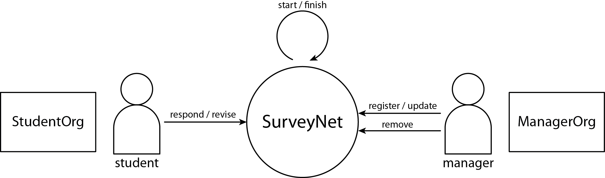
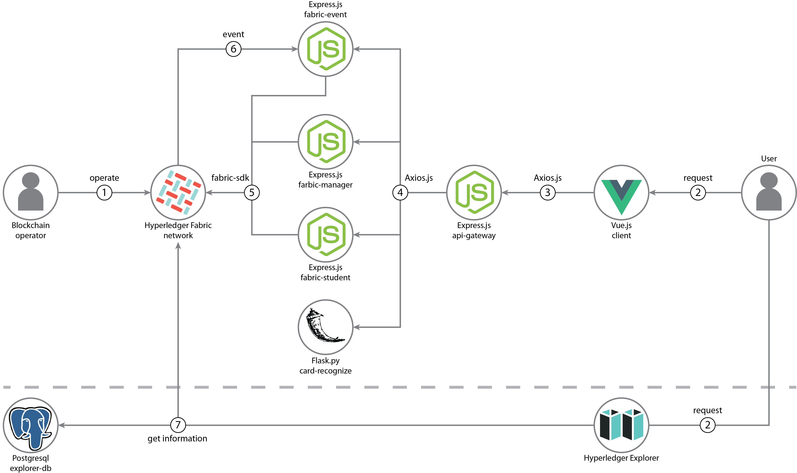
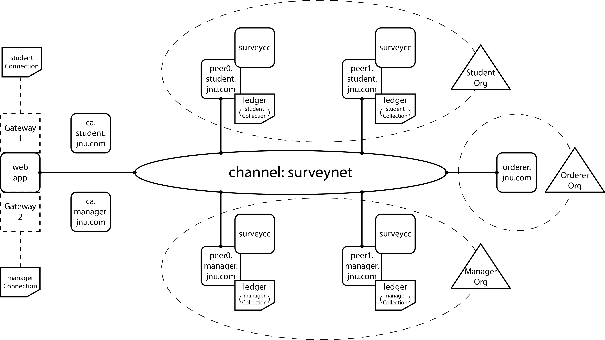
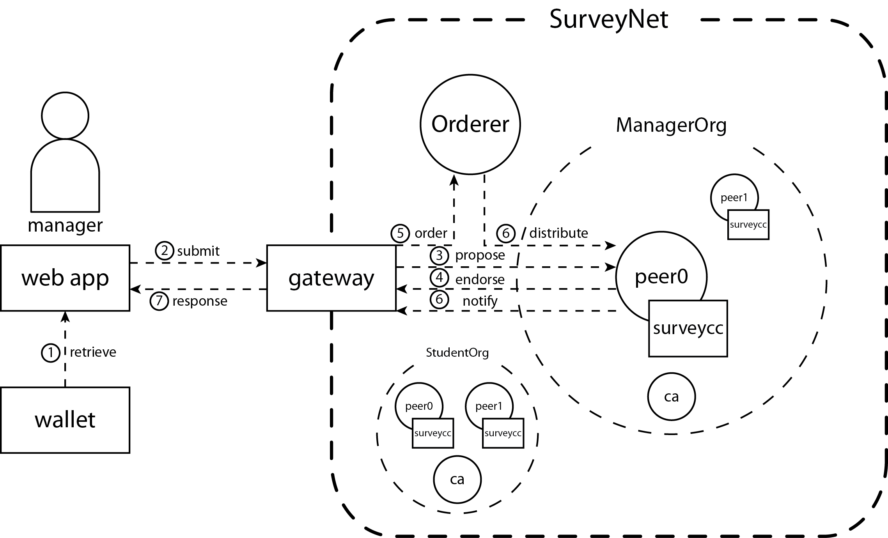
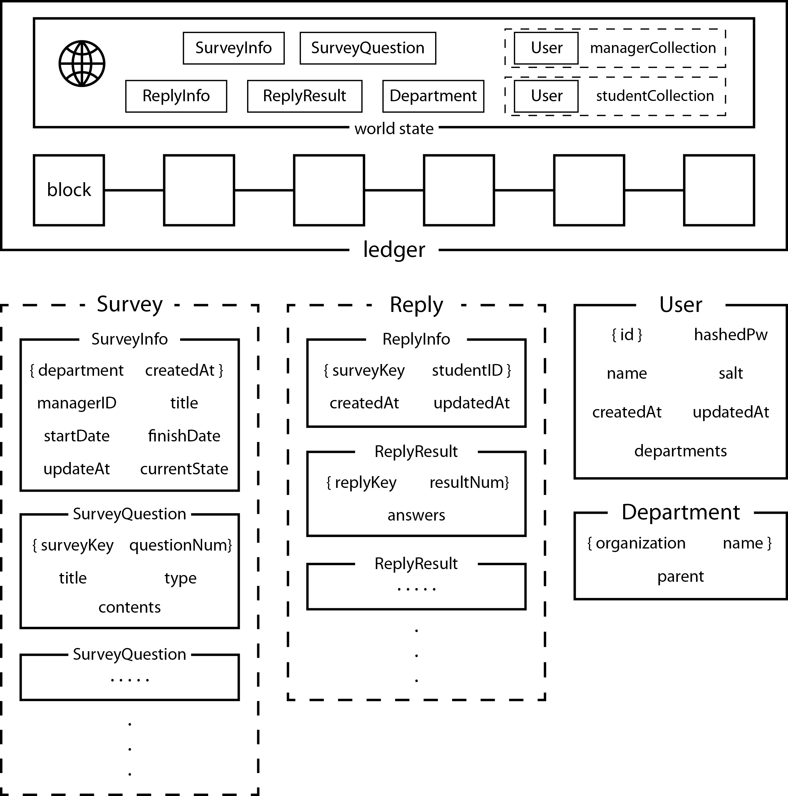
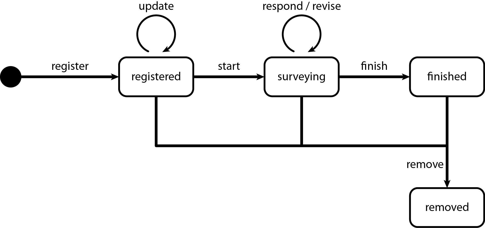

# Create a JNU survey application with Hyperledger Fabric

**:mag: Note: I wrote this through a translator :mag_right:**

**This application allows managers to register surveys and check students' responses**

<br>

<p align="center">
  
</p>
<br>

[Click here to view the network architecture](#about-the-surveynet-fabric-network)

---

## Flow Diagram

<br>
<p align="center">
  
</p>
<br>

1. The blockchain operator sets up the Hyperledger Fabric network and the operator installs and instantiates the smart contract on the Fabric network.
2. The User interacts with the Vue.js Web interface to register surveys and responses, or with the Explorer to identify blocks in the Fabric network.
3. The Vue.js client uses the API gateway to interact with the overall servers.
4. The API gateway uses the Express.js applications API to interact with the fabric network and uses the Flask.py application API to recognize card information.
5. The Express.js application servers use the fabric-sdk-node to interact with the deployed fabric network and creates APIs for a web client.
6. The Fabric network notifies the event processing Express.js application when an event occurs during an interaction.
7. The Explorer identifies blocks by interacting with the fabric network through the postgresql DB.

## Featured technologies

- [Hyperledger Fabric v1.4](https://hyperledger-fabric.readthedocs.io/en/release-1.4/) is a platform for distributed ledger solutions, underpinned by a modular architecture that delivers high degrees of confidentiality, resiliency, flexibility, and scalability.
- [Hyperledger Explorer](https://blockchain-explorer.readthedocs.io/en/master/index.html) is a user-friendly Web application tool used to view, invoke, deploy or query blocks, transactions and associated data, network information, chain codes and transaction families, as well as any other relevant information stored in the ledger.
- [Node.js](https://nodejs.org) is an open source, cross-platform JavaScript run-time environment that executes server-side JavaScript code.
- [Vue.js](https://vuejs.org) is an open-source JavaScript framework for building user interfaces and single-page applications.
- [Flask.py](https://flask.palletsprojects.com/en/1.1.x/) is a lightweight WSGI web application framework. It is designed to make getting started quick and easy, with the ability to scale up to complex applications.
- [Tesseract](https://github.com/tesseract-ocr/tesseract) is an optical character recognition engine for various operating systems.

## Test Environment Software Versions

**:warning: Note: You will need Node >=10.15.3 to run this pattern! :warning:**
| Program | Version | Program | Version |
| :---: | :---: | :---: | :---: |
| Hyperledger Fabric | 1.4.0 | Hyperledger Explorer | 1.0.0 |
| docker | 18.09.7 | docker-compose | 1.17.1 |
| node | 10.20.1 | NPM | 6.14.4 |
| python | 3.6.9 | pip | 20.0.2 |
| Go | 1.11 |

---

## Steps (Local Deployment using dockerize web app)

1. [Clone the Repo](#step-1-clone-the-repo)
2. [Prepare prerequisites By shell script](#step-2-prepare-prerequisites-by-shell-script)
3. [Start the Fabric network By shell script](#step-3-start-the-fabric-network-by-shell-script)
4. [Run the Dockerize web apps By shell script](#step-4-run-the-dockerize-web-apps-by-shell-script)

### Step 1. Clone the Repo

Git clone this repo onto your computer:

```bash
ubuntu$ git clone https://github.com/woojae9488/fabric-survey-app
ubuntu$ cd fabric-survey-app/
```

### Step 2. Prepare prerequisites By shell script

The shell script in the fabric-survey-app folder provides simple preparation:

```bash
ubuntu$ chmod +x prepare.sh
ubuntu$ sudo ./prepare.sh light
ubuntu$ source ./environment
```

If your computer has less than 1.5GB of memory, you need to add an -S option or an -s \<size> Option to create a swapfile.

After all the scripts are run, the version will be checked at the end. Check the versions of the other programs except python and pip.

The source command is to set the necessary environment variables for starting the fabric network.

For more details, see the contents of the prepare.sh file.

### Step 3. Start the Fabric network By shell script

The shell script in the fabric-survey-app folder provides simple Fabric network startup:

```bash
ubuntu$ chmod +x operate.sh
ubuntu$ sudo ./operate.sh up
```

When you run a script, the following things happen in order:

1. Generate certificates through the "artifacts/crypto-config.yaml" file.
2. Generate channel artifacts through the "artifacts/configtx.yaml" file.
3. Deploy the required containers on the Fabric network through the docker-compose command and the "arifacts/docker-compose.yaml" file.
4. Run the "scripts/script.sh" file using the cli docker container.

When you run a script in the cli docker container, the following things happen in order:

1. Create a surveynet channel.
2. All peers join in the surveynet channel.
3. Update anchor peers for each organization.
4. Install chaincode on all peers.
5. Instantiate chaincode in each peer.
6. The query and Invoke are tested since all configurations are complete.

For more details, see the contents of the operate.sh file.

### Step 4. Run the Dockerize web apps By shell script

Now, finally, run only the deploy.sh shell script will end the whole process.

```bash
ubuntu$ cd web-app/
ubuntu$ chmod +x deploy.sh
ubuntu$ sudo ./deploy.sh start all
```

If everything is done well, we are ready to access our fabric network.
Go to http://[HOST-IP]:8080/ to view the client app, or http://[HOST-IP]:8888/ to view the Explorer app. :smile: <br>
Now test the web you created. The id and password of the existing manager are admin, adminpw.

If you want to run applications separately from the Explorer or just the Explorer, you can run them through the following commands:

```bash
ubuntu$ sudo ./deploy.sh start msa       # Exclude the Explorer
ubuntu$ sudo ./deploy.sh start explorer  # Just the Explorer
```

For more information, see the contents of the deploy.sh file and the resources in the docker-config directory.

---

## Steps (Local Deployment without dockerize web app)

It is not possible to run the Explorer when running web applications in a local deployment because only dockerized Explorer is available in this code pattern.

These steps overlap with the preceding steps(Step 1. and Step 3.). Therefore, I will explain the other parts only.

1. [Clone the Repo](#step-1-clone-the-repo)
2. [Prepare all prerequisites By shell script](#step-2-prepare-all-prerequisites-by-shell-script)
3. [Start the Fabric network By shell script](#step-3-start-the-fabric-network-by-shell-script)
4. [Run the web servers and client](#step-4-run-the-web-servers-and-client)

### Step 2. Prepare all prerequisites By shell script

The shell script in the fabric-survey-app folder provides simple preparation:

```bash
ubuntu$ chmod +x prepare.sh
ubuntu$ sudo ./prepare.sh all
ubuntu$ source ./environment
```

If your computer has less than 1.5GB of memory, you need to add an -S option or an -s \<size> Option to create a swapfile.

After all the scripts are run, the version will be checked at the end. Make sure that all version of the programs are checked.

The source command is to set the necessary environment variables for starting the fabric network.

For more details, see the contents of the prepare.sh file.

### Step 4. Run the web servers and client

To deploy without a dockerize web servers or client, each servers and client must be run directly.
At this step, you can modify and execute the code as you wish.

First, let's run a fabric-manager server, a fabric-student server, and a fabric-event server that connects to the fabric network.

```bash
ubuntu$ cd web-app/servers/fabric-manager/
ubuntu$ npm install
ubuntu$ npm start
ubuntu$ cd ../fabric-student/
ubuntu$ npm install
ubuntu$ npm start
ubuntu$ cd ../fabric-event/
ubuntu$ npm install
ubuntu$ npm start
```

Here, the fabric-student server does not matter, but the fabric-event server must run later than the fabric-manager server.
(This is because the fabric-manager server registers the certificate of the fabric-event server.)

Then, run the card-recognize server and the API gateway.

```bash
ubuntu$ cd ../card-recognize/
ubuntu$ pip3 install -r ./requirements.txt
ubuntu$ python3 app.py
ubuntu$ cd ../api-gateway/
ubuntu$ npm install
ubuntu$ npm start
```

If you don't want to use Chonnam National University's student card recognition, you don't have to run the card-recognize server and you have to change the client's student signup process.

Finally, run the client.

```bash
ubuntu$ cd ../../client/
ubuntu$ npm install
ubuntu$ npm run serve
```

If everything is done well, we are ready to access our fabric network. Go to http://localhost:8080/ to see your app. :smile: <br>
Now test the web you created. The id and password of the existing manager are admin, adminpw.

---

## Stop the Fabric network

After testing network, or if an error occurs and the network must be stopped, go to the fabric-survey-app folder and the following should be done:

```bash
ubuntu$ sudo ./operate.sh down
```

If you also want to shut down dockerize web apps:

```bash
ubuntu$ cd web-app/
ubuntu$ sudo ./deploy.sh stop all  # Or msa or explorer
```

---

## About the surveynet Fabric network

This section will show pictures of the network structure or elements of the surveynet.

### Structure of the surveynet Fabric network

<br>
<p align="center">
  
</p>
<br>

### How an application communicates with a network

<br>
<p align="center">
  
</p>
<br>

### Datasets stored in the ledger

<br>
<p align="center">
  
</p>
<br>

### lifecycle of survey state

<br>
<p align="center">
  
</p>
<br>

---

## References

### The most helpful references

- [hyperledger-fabricdocs (release-1.4)](https://hyperledger-fabric.readthedocs.io/en/release-1.4/)
- [Hyperledger Fabric SDK for node.js](https://hyperledger.github.io/fabric-sdk-node/release-1.4/index.html)
- [Hyperledger Fabric contract SDK for node.js](https://hyperledger.github.io/fabric-chaincode-node/release-1.4/api/)
- [hyperledger/fabric-samples/first-network](https://github.com/hyperledger/fabric-samples/tree/release-1.4/first-network)
- [hyperledger/fabric-samples/balance-transfer](https://github.com/hyperledger/fabric-samples/tree/release-1.4/balance-transfer)
- [hyperledger/fabric-samples/commercial-paper](https://github.com/hyperledger/fabric-samples/tree/release-1.4/commercial-paper)
- [hyperledger/blockchain-explorer](https://github.com/hyperledger/blockchain-explorer)
- [IBM/evote](https://github.com/IBM/evote)
- [IBM/auction-events](https://github.com/IBM/auction-events)
- [Vue.js](https://kr.vuejs.org/v2/guide/index.html)
- [Vue Router](https://router.vuejs.org/kr/)
- [BootstrapVue](https://bootstrap-vue.js.org/)

### About using Hyperledger Fabric with Node

- [Walkthrough of HLF Node SDK and Client App](https://medium.com/datadriveninvestor/walkthrough-of-hyperledger-fabric-client-application-aae5222bdfd3)
- [Exploring Fabric-CA: Registration and Enrollment](https://medium.com/@kctheservant/exploring-fabric-ca-registration-and-enrollment-1b9f4a1b3ace)
- [PutState and GetState](https://medium.com/@kctheservant/putstate-and-getstate-the-api-in-chaincode-dealing-with-the-state-in-the-ledger-part-2-839f89ecbad4)
- [Private Data in Hyperledger Fabric](https://medium.com/beyondi/private-data-in-hyperledger-fabric-3aaa8a3994ed)
- [Connection Profiles](https://hyperledger.github.io/composer/v0.19/reference/connectionprofile)
- [How to deploy chaincode in Hyperledger Fabric?](https://medium.com/beyondi/how-to-deploy-chaincode-in-hyperledger-fabric-7202204d0238)

### About using Node for deploy the servers

- [MartinYounghoonKim/nodejs-authenticate-jwt-vuejs](https://github.com/MartinYounghoonKim/nodejs-authenticate-jwt-vuejs)
- [자바스크립트 async와 await](https://joshua1988.github.io/web-development/javascript/js-async-await/)
- [async/await으로 콜백지옥을 해결해보자](https://victorydntmd.tistory.com/87)
- [RESTful API 설계 가이드](https://sanghaklee.tistory.com/57)
- [모두 알지만 모두 모르는 package.json](https://programmingsummaries.tistory.com/385)
- [Node.js 기반에서 환경변수 사용하기](https://velog.io/@public_danuel/process-env-on-node-js)
- [특정 시간에 이벤트 발생시키기](https://yonghyunlee.gitlab.io/node/node-schedule/)
- [Nodejs lowdb 사용하기](https://m.blog.naver.com/PostView.nhn?blogId=pjok1122&logNo=221569697267&proxyReferer=https%3A%2F%2Fwww.google.com%2F)
- [Node.js 가 로컬, 글로벌 모듈을 탐색하는 순서를 확인해보자](https://ondemand.tistory.com/240)
- [MSA 제대로 이해하기 - MSA의 기본 개념](https://velog.io/@tedigom/MSA-%EC%A0%9C%EB%8C%80%EB%A1%9C-%EC%9D%B4%ED%95%B4%ED%95%98%EA%B8%B0-1-MSA%EC%9D%98-%EA%B8%B0%EB%B3%B8-%EA%B0%9C%EB%85%90-3sk28yrv0e)
- [API Gateway 구현](https://m.blog.naver.com/1ilsang/221575505442)
- [ecojuntak/api-gateway](https://github.com/ecojuntak/api-gateway)

### About using Vue for deploy the client

- [Vue 컴포넌트 데이터 주고 받기](https://cchoimin.tistory.com/entry/%EC%9E%91%EC%84%B1%EC%A4%91-Vuejs-vue-%EC%BB%B4%ED%8F%AC%EB%84%8C%ED%8A%B8-%ED%86%B5%EC%8B%A0)
- [Vue에서 중첩 데이터를 감시하는 법](https://ui.toast.com/weekly-pick/ko_20190307/)
- [Vue.js 컴포넌트 재사용하기 - slot 편](https://joshua1988.github.io/web-development/vuejs/slots/)
- [Vue Router의 LifeCycle 이해하기](https://adeuran.tistory.com/14)
- [Vue.js 라우터 네비게이션 가드 알아보기](https://joshua1988.github.io/web-development/vuejs/vue-router-navigation-guards/)
- [Component 개념을 익히고 만들어보자!!](https://kdydesign.github.io/2019/04/27/vue-component/)
- [Axios 러닝 가이드](https://yamoo9.github.io/axios/guide/)
- [javascript로 이미지 업로드 및 미리보기 기능 구현하는 방법](https://dahanweb.tistory.com/58)
- [LocalStorage, SessionStorage 클라이언트에 정보 저장](https://dev.eyegood.co.kr/entry/Javascript-LocalStorage-SessionStorage-%ED%81%B4%EB%9D%BC%EC%9D%B4%EC%96%B8%ED%8A%B8%EC%97%90-%EC%A0%95%EB%B3%B4-%EC%A0%80%EC%9E%A5)
- [Vue.js와 Chart.js를 이용하여 아름다운 차트 만들기](https://chuckolet.tistory.com/8)
- [Vue cli 4 환경 변수 설정하기](https://blog.eunsatio.io/develop/Vue-cli-4-%ED%99%98%EA%B2%BD-%EB%B3%80%EC%88%98-%EC%84%A4%EC%A0%95%ED%95%98%EA%B8%B0)

### About using Flask and Tesseract for deploy the card recognize api

- [파이썬 Flask를 이용하여 REST API 만들기](https://rekt77.tistory.com/103)
- [Axios, POST request to Flask](https://stackoverflow.com/questions/45373124/axios-post-request-to-flask)
- [opencv / pytesseract를 활용한 image2text](https://shinminyong.tistory.com/5)
- [Python OpenCV 강좌 : 제 1강 - OpenCV 설치](https://076923.github.io/posts/Python-opencv-1/)
- [딥러닝과 OpenCV를 활용해 사진 속 글자 검출하기](https://d2.naver.com/helloworld/8344782)
- [OpenCV - 이미지에서 텍스트 영역만 찾아내기](https://leembedded.tistory.com/26)
- [바코드 / QR코드 인식하기](https://www.opentutorials.org/module/3811/25284)
- [Python에서 Open API 호출하기](https://bcho.tistory.com/822)
- [How to convert base64 string to image?](https://stackoverflow.com/questions/16214190/how-to-convert-base64-string-to-image/16214280)

### The others

- [도커 이미지 빌드 원리와 OverlayFS](https://www.44bits.io/ko/post/how-docker-image-work)
- [초보를 위한 도커 안내서 - 이미지 만들고 배포하기](https://subicura.com/2017/02/10/docker-guide-for-beginners-create-image-and-deploy.html)
- [리액트 프로젝트에 ESLint 와 Prettier 끼얹기](https://velog.io/@velopert/eslint-and-prettier-in-react#prettier-%EC%9D%B5%EC%8A%A4%ED%85%90%EC%85%98-%EC%82%AC%EC%9A%A9%ED%95%98%EA%B8%B0)
- [마크다운 사용법](https://gist.github.com/ihoneymon/652be052a0727ad59601)
- [ParkSB/javascript-style-guide](https://github.com/ParkSB/javascript-style-guide#%EB%B3%80%EC%88%98-variables)
- [Apache License 2.0 사용법](https://linuxism.ustd.ip.or.kr/1143)
- [Fixing security vulnerabilities in npm dependencies](https://itnext.io/fixing-security-vulnerabilities-in-npm-dependencies-in-less-than-3-mins-a53af735261d)
